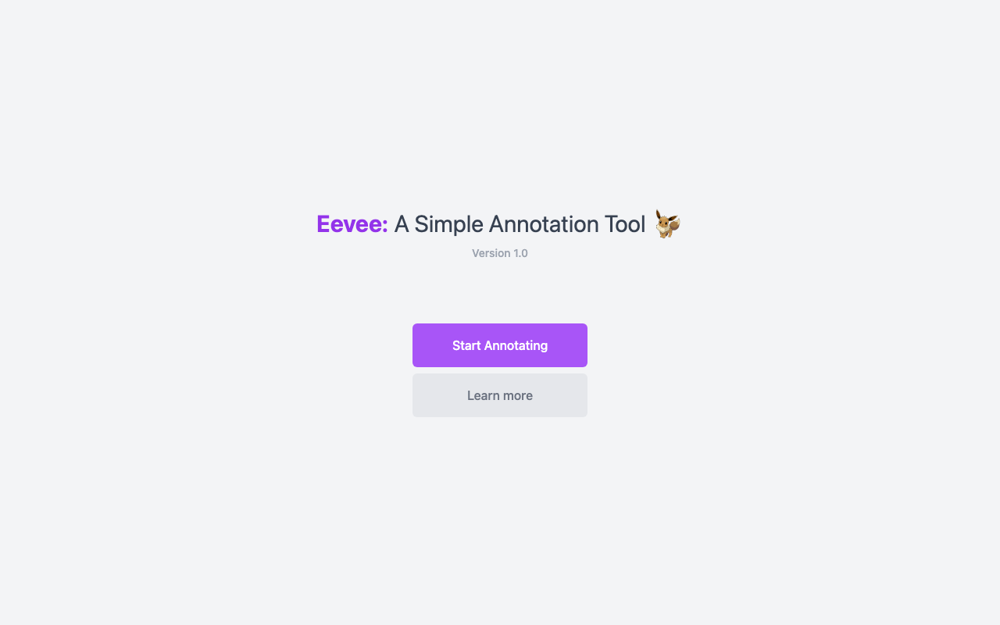

# 🦊 Eevee NLP

A Vue 3 tool for annotating and running NLP tasks (sequence labeling, classification, seq2seq, bio-tagging) on custom data.



## Features

- 🏷️ **Multiple task types** — dedicated views for sequence labeling (`Seq`), classification (`Class`), seq2seq (`Seq2Seq`), and biological sequence tagging (`SeqBio`)
- ✍️ **Annotation workspace** — a data field, task field, and controls for labeling text, plus a sidebar for navigating datasets
- ⚙️ **Background processing** — a web worker (`worker.js`) offloads heavier NLP computation from the UI thread
- 📱 **Installable** — configured as a PWA via `vite-plugin-pwa`

## Installation

```bash
git clone <this repo>
cd EeveeTest
npm install
```

## Usage

```bash
npm run dev
```

Then open the printed local URL (default Vite port, typically [http://localhost:5173](http://localhost:5173)).

## Built with

- [Vue 3](https://vuejs.org/) + [Vite](https://vitejs.dev/)
- [Tailwind CSS](https://tailwindcss.com/)
- Font Awesome icons
- Vue Router

## Status

🚧 Prototype — functional task views exist for several NLP annotation types, but there's no backend/persistence layer visible; annotations likely live in-memory only.

✅ Runs cleanly — `npm install && npm run build` verified working as of 2026-09-03 (Vite + PWA build succeeds with no errors).
